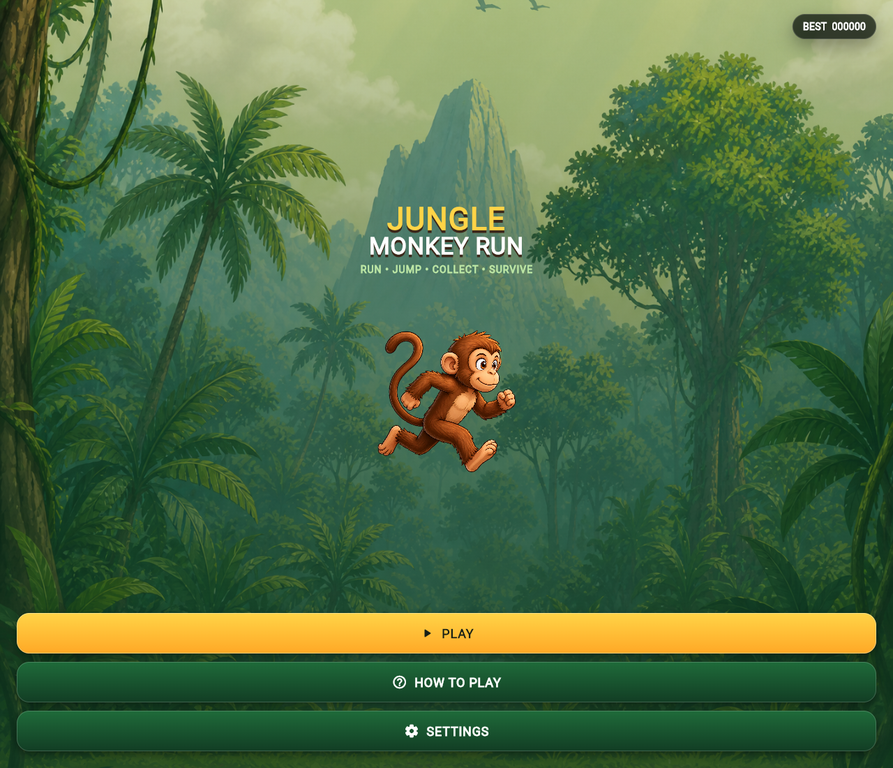
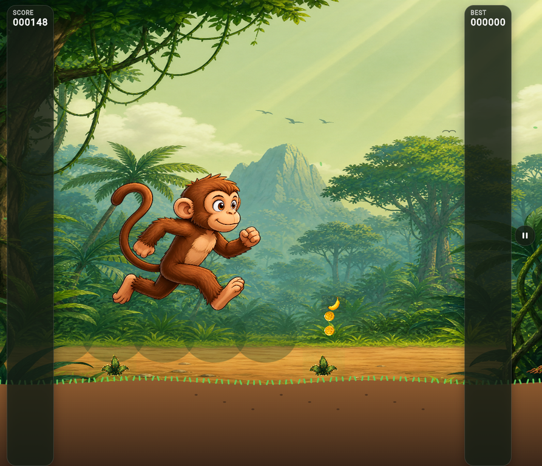

# Jungle Monkey Run

**Jungle Monkey Run** is an original, offline-first Android endless runner built with **Flutter** and the **Flame Engine**. A playful jungle monkey runs through a richly illustrated tropical world while the player jumps over hazards, collects coins and bananas, raises an arcade score, and tries to beat a locally stored best score.

The project deliberately uses original bundled artwork and does not use Google Chrome Dinosaur Game assets, branding, characters, or logos. All visible game text is in English.

| Project detail | Value |
| --- | --- |
| Application id | `com.aksisoft.junglemonkeyrun` |
| Orientation | Portrait, 9:16 adaptive gameplay area |
| Version | `1.0.0+1` |
| Engine | Flutter + Flame |
| Offline storage | SharedPreferencesAsync |
| Android output | Release APK |
| Primary controls | Tap anywhere in gameplay to jump |

## Features

The game has a branded jungle Home screen, first-play tutorial, short countdown, minimal score HUD, pause menu, settings view, and a polished Game Over result card. The runner uses increasing speed, gentle terrain variation, fair procedural obstacle gaps, collectible trails, score milestones, local best-score persistence, and locally bundled music. It includes an original monkey, lush illustrated jungle background, fallen logs, exposed roots, rocks, thorny plants, coins, bananas, golden bananas, and a generated adaptive Android launcher icon.

The collision sequence is intentionally family-friendly. It stops spawning and movement, adds a short impact pause and subtle shake, shifts the monkey to a disappointed hand-lick pose, then displays the Game Over overlay.

## Screenshots

| Home screen | Active gameplay |
| --- | --- |
|  |  |

## Controls and scoring

| Action | Result |
| --- | --- |
| Tap the gameplay area | Jump when the monkey is on the ground. |
| Pause button | Opens the Pause overlay. |
| Coin | Adds 10 points. |
| Banana | Adds 25 points. |
| Golden banana | Adds 100 points. |
| Collision | Initiates the humorous impact, hand-lick, and Game Over sequence. |

## Local setup

Install a current stable Flutter SDK with Android tooling, then run the following commands from the repository root.

```bash
flutter pub get
flutter analyze
flutter test
flutter build apk --release
```

The release artifact is written to:

```text
build/app/outputs/flutter-apk/app-release.apk
```

The application runs entirely offline after installation. Runtime images and music are bundled beneath `assets/`; no required gameplay asset uses an external URL.

## Architecture

Flutter owns screens, dialogs, safe-area UI, navigation, local preferences, and Android integration. Flame owns the game loop, input, jumping physics, rendering, scrolling, collision tests, spawning, and game-state transitions. Additional technical notes are retained in [PLAN.md](PLAN.md), [STRUCTURE.md](STRUCTURE.md), [ASSETS.md](ASSETS.md), and [MEMORY.md](MEMORY.md).

## Continuous integration

The GitHub Actions workflow at `.github/workflows/android-build.yml` runs on every push and pull request. It formats, analyzes, tests, builds a release APK, and uploads it as the `jungle-monkey-run-release-apk` artifact.

## Test coverage

The automated tests cover score progression, collectible point values, combo behavior, difficulty scaling, safe obstacle-distance growth, collision detection, and a tappable primary UI control. The project was also validated with static analysis and a local release APK build.
